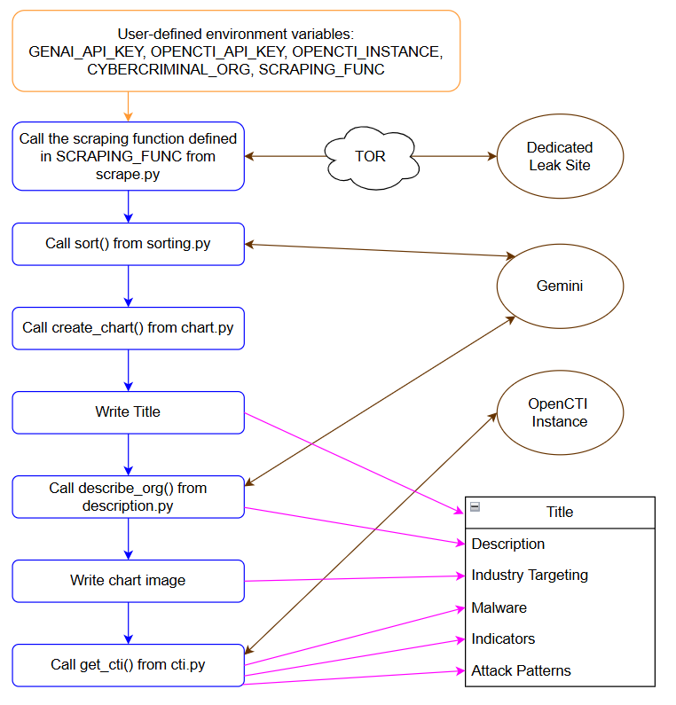

# Creating Threat Profiles of Cybercriminal Organizations Using Automation

## Description

This GitHub contains the code to produce threat profiles of three cybercriminal organizations using automation. Each threat profile contains a description of the cybercriminal organization, a bar chart displaying the victims of the cybercriminal organization categorized by NAICS sectors, a table with the names of malware associated with the group, tables of indicators grouped by the date they are valid until, a table of attack patterns and their MITRE IDs, and an appendix containing the descriptions of the attacks patterns. The threat profiles are produced by scraping a dedicated leak site using Playwright and parsing the HTML using Beautiful Soup to get a list of victims, then Gemini is used to categorize the victims into NAICS sectors, and this information is displayed in a bar chart using Matplotlib. Then, Gemini is used to produce a description of the group. After this the malware, indicators, and attack patterns associated with a cybercriminal organization is gathered using OpenCTI and put into tables using Pandas. The threat profile produced is written in markdown, so the user can audit, edit, and add to the document.

## Important Note

Running threat_profile.py or scrape.py will scrape links from the dark web. Scraping the dark web has its risks so proceed with caution. The scripts also rely on various APIs and libraries, so make sure to read the terms of use and guidelines for each of these APIs and libraries. 

## Instructions to Run

To produce the threat profiles complete the following steps:

1. Enter values for each environment variable in setup.sh
2. Enter the following command in the terminal: ``` python3 threat_profile.py ```

To run the other scripts individually, follow the steps above but replace threat_profile.py in the above command with the name of script you want to run.

## Code Flow Diagram

The diagram below shows how all the functions from different scripts get called within threat_profile.py to produce the threat profiles. The orange arrow shows the user-defined environment variables that get used by threat_profile.py and the functions it calls. The blue arrows show communication between the scripts. The brown arrows show communication between the scripts and external sources. The pink arrows show what information was added to the threat profile.

